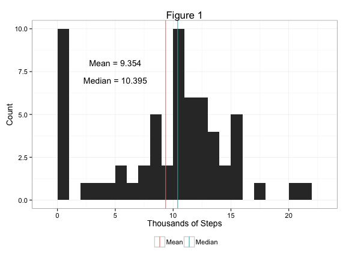
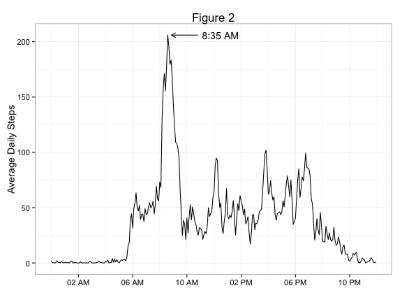
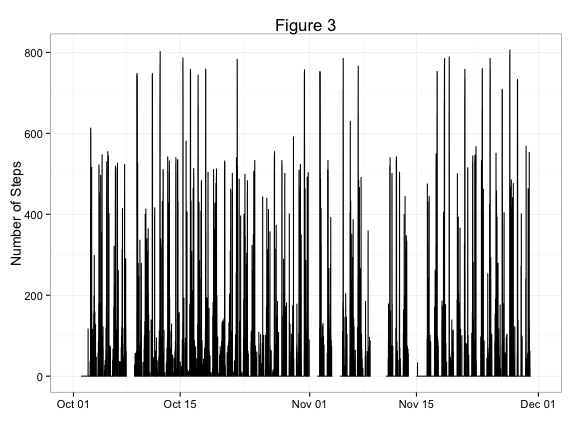
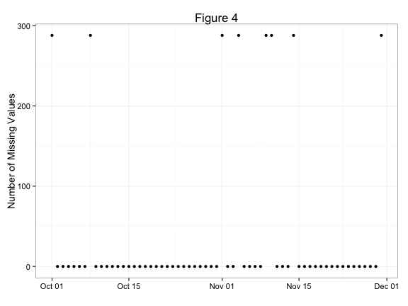
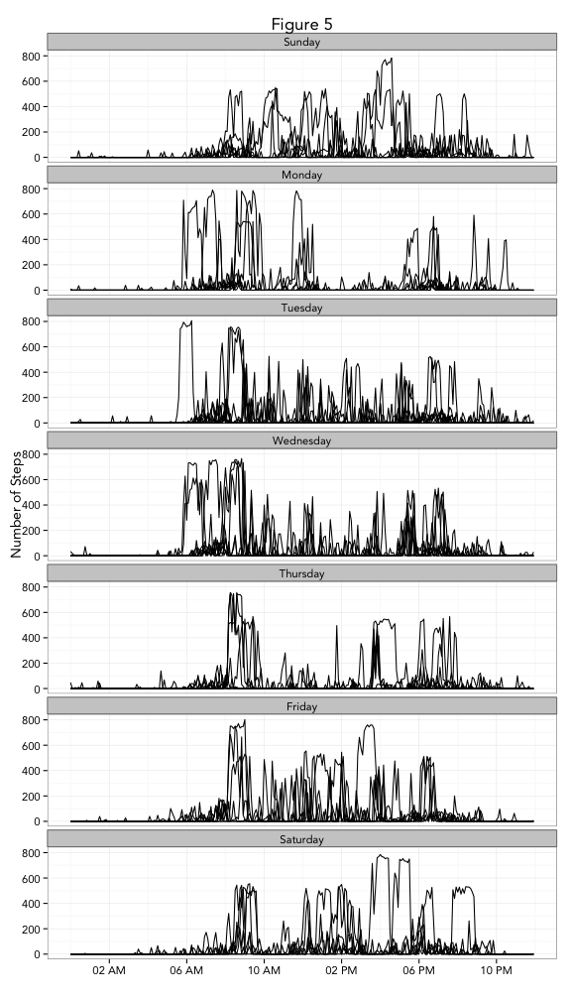
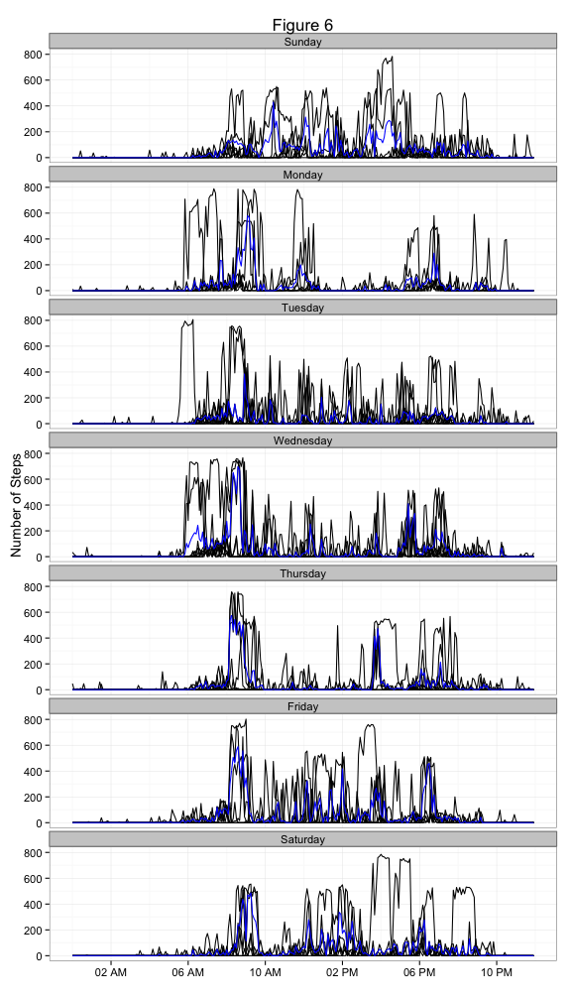
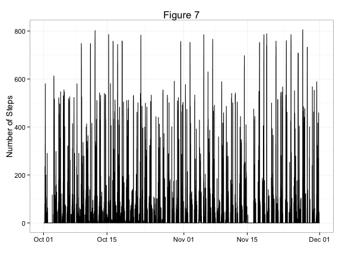
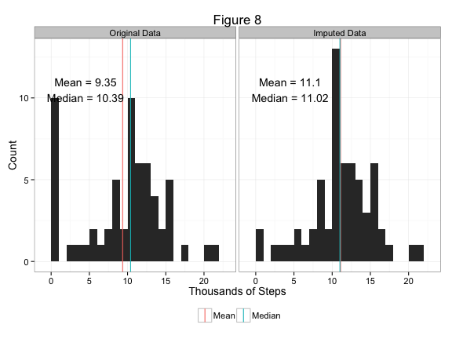
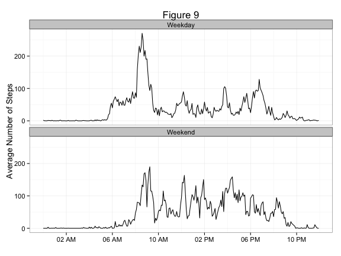

Activity Monitoring Data Processing and Analysis
========================================================
Denis Willett


#### Set Global Obtions and Load Libraries
First we'll set the global options so that warning messages do not appear and figures are appropriately sized.  


```r
opts_chunk$set(fig.width = 8, fig.height = 6, echo = TRUE, warning = FALSE, 
    message = FALSE)
```


Next we'll load libraries to be used for data analysis.  I'm partial to *ggplot2*, so thats what'll be used for plotting.  *Lubridate* makes dates relatively easy; *dplyr* and *reshape2* help with data manipulation.  


```r
library(ggplot2)
library(lubridate)
library(dplyr)
library(scales)
library(grid)
library(reshape2)
```


## Loading and Preprocessing the Data
Now its time to load the data and briefly examine it.  


```r
act = read.csv("activity.csv")  #Make Sure working directory is appropriate
head(act)
```

```
##   steps       date interval
## 1    NA 2012-10-01        0
## 2    NA 2012-10-01        5
## 3    NA 2012-10-01       10
## 4    NA 2012-10-01       15
## 5    NA 2012-10-01       20
## 6    NA 2012-10-01       25
```

```r
tail(act)
```

```
##       steps       date interval
## 17563    NA 2012-11-30     2330
## 17564    NA 2012-11-30     2335
## 17565    NA 2012-11-30     2340
## 17566    NA 2012-11-30     2345
## 17567    NA 2012-11-30     2350
## 17568    NA 2012-11-30     2355
```

```r
str(act)
```

```
## 'data.frame':	17568 obs. of  3 variables:
##  $ steps   : int  NA NA NA NA NA NA NA NA NA NA ...
##  $ date    : Factor w/ 61 levels "2012-10-01","2012-10-02",..: 1 1 1 1 1 1 1 1 1 1 ...
##  $ interval: int  0 5 10 15 20 25 30 35 40 45 ...
```


Initially it looks like no preprocessing is needed.  Some tweeks might be required for individual subsequent analysis, but by and large the data should initially work well as is.  

## What is mean total number of steps taken per day?

Now we can delve into playing with the data.  The first step is to determine the total number of steps (in units of 1000 steps) taken per day.  


```r
tots = act %.% group_by(date) %.% summarize(tsteps = sum(steps, na.rm = TRUE)/1000)
head(tots)
```

```
## Source: local data frame [6 x 2]
## 
##         date tsteps
## 1 2012-10-01  0.000
## 2 2012-10-02  0.126
## 3 2012-10-03 11.352
## 4 2012-10-04 12.116
## 5 2012-10-05 13.294
## 6 2012-10-06 15.420
```


Next, based on those calculations we'll calculate the mean and median total number of steps per day in thousands of steps.


```r
summs = data.frame(Type = c("Mean", "Median"), Vals = c(mean(tots$tsteps, na.rm = TRUE), 
    median(tots$tsteps, na.rm = TRUE)))
summs
```

```
##     Type   Vals
## 1   Mean  9.354
## 2 Median 10.395
```


Then we'll plot those data in a nice histogram with the mean and median overlaid.   


```r
ggplot() + geom_histogram(data = tots, aes(x = tsteps), binwidth = 1) + theme_bw(14) + 
    geom_vline(data = summs, aes(xintercept = Vals, color = Type), show_guide = TRUE) + 
    theme(legend.position = "bottom", legend.title = element_blank()) + labs(x = "Thousands of Steps", 
    y = "Count", title = "Figure 1") + annotate("text", x = 5, y = 8, label = paste("Mean =", 
    round(summs$Vals[1], 3))) + annotate("text", x = 5, y = 7, label = paste("Median =", 
    round(summs$Vals[2], 3)))
```

 


## What is the average daily activity pattern?

To calculate this, we'll first have to average across all days grouping by interval.  For this, NAs will be excluded from the analysis.  We'll also add a column with *lubridate* to facilitate time plotting later.  


```r
int_steps = act %.% group_by(interval) %.% summarize(isteps = mean(steps, na.rm = TRUE)) %.% 
    mutate(time = seq(mdy_hms("1/1/2000 00:00:00"), mdy_hms("1/1/2000 23:55:00"), 
        by = 300))

head(int_steps)
```

```
## Source: local data frame [6 x 3]
## 
##   interval  isteps                time
## 1        0 1.71698 2000-01-01 00:00:00
## 2        5 0.33962 2000-01-01 00:05:00
## 3       10 0.13208 2000-01-01 00:10:00
## 4       15 0.15094 2000-01-01 00:15:00
## 5       20 0.07547 2000-01-01 00:20:00
## 6       25 2.09434 2000-01-01 00:25:00
```


Now lets see what the maximum is.  


```r
mx = max(int_steps$isteps)

int_steps[which(int_steps$isteps == mx), ]
```

```
## Source: local data frame [1 x 3]
## 
##     interval isteps                time
## 104      835  206.2 2000-01-01 08:35:00
```


Cool! Looks like the maximum is 206.1698 at 08:35 AM.  


Now we'll plot the average number of daily steps by time intervals ranging from the start at midnight for a full day and label the maximum point.   


```r
tmim = int_steps[which(int_steps$isteps == mx), ]$time

ggplot() + geom_line(data = int_steps, aes(x = time, y = isteps)) + theme_bw(14) + 
    scale_x_datetime(labels = date_format("%I %p"), breaks = date_breaks("4 hour")) + 
    labs(x = "", y = "Average Daily Steps", title = "Figure 2") + geom_segment(aes(x = tmim + 
    8000, xend = tmim + 1000, y = 206, yend = 206), arrow = arrow(length = unit(0.24, 
    "cm"))) + annotate("text", x = tmim + 14000, y = 206, label = "8:35 AM")
```

 


## Imputing missing values

#### 1. Determine number of NAs
Now we'll see how many NAs there are and if imputing values changes our interpretations.  First, how many NAs are there?


```r
sum(is.na(act$steps))
```

```
## [1] 2304
```


It looks like we have 2304 NAs.  We have some imputing to do!

#### 2. Develop Imputation Strategy
First lets look at the entire data set and see where the gaps are.  


```r
plotall = mutate(act, time = seq(ymd_hms(paste(first(act$date), "00:00:00")), 
    ymd_hms(paste(last(act$date), "23:55:00")), by = 300), hr = hour(time), 
    min = minute(time))

ggplot(plotall, aes(x = time, y = steps)) + geom_line() + theme_bw(14) + labs(y = "Number of Steps", 
    x = "", title = "Figure 3")
```

 


It looks like there aren't sporadic gaps so much as complete days where the data are missing - which could represent days when the individual did not wear the device (somewhat odd though given the precise stop and start times at midnight).  Lets check that by examining the temporal distribution of NAs.  


```r
whereNA = plotall %.% group_by(month(time), day(time)) %.% summarize(nn = sum(is.na(steps)), 
    tm = first(time))

ggplot(whereNA, aes(x = tm, y = nn)) + geom_point() + theme_bw(14) + labs(x = "", 
    y = "Number of Missing Values", title = "Figure 4")
```

 


As expected, most days are complete, but some are entirely missing with 288 NAs, the total number of 5 minute intervals in a day.  

Given that averaging over five minute intervals only gives a maximum number of steps around 206 (Figure 2), and our examination of the entire data set shows many values much larger than 206 (Figure 3), simply replacing the missing values with averages does not seem an adequate imputation strategy.  

Lets examine week day activity patterns.  


```r
test = mutate(plotall, d = wday(time, label = TRUE, abbr = FALSE), tm = rep(seq(mdy_hms("1/1/2000 00:00:00"), 
    mdy_hms("1/1/2000 23:55:00"), by = 300), 61))

ggplot(test, aes(x = tm, y = steps, group = date)) + geom_line() + facet_wrap(~d, 
    ncol = 1) + scale_x_datetime(labels = date_format("%I %p"), breaks = date_breaks("4 hour")) + 
    theme_bw(14, base_family = "Avenir") + labs(x = "", y = "Number of Steps", 
    title = "Figure 5")
```

 


It looks like each week day has specific patterns.  Lets give the user the benefit of the doubt and assume that the missing data resulted from a lapse in memory due to realitively high activity and compare the 75th percentile of activity to week day trends (blue line below).  


```r
replot = test %.% group_by(d, tm) %.% summarize(av = mean(steps, na.rm = TRUE), 
    qs = quantile(steps, 0.75, na.rm = TRUE))

ggplot() + geom_line(data = test, aes(x = tm, y = steps, group = date)) + geom_line(data = replot, 
    aes(x = tm, y = qs), color = "blue") + facet_wrap(~d, ncol = 1) + scale_x_datetime(labels = date_format("%I %p"), 
    breaks = date_breaks("4 hour")) + theme_bw(14) + labs(x = "", y = "Number of Steps", 
    title = "Figure 6")
```

 


Qualitatively that strategy looks fairly decent.  It seems to avoid artificially depressing the number of steps as would be done with an average (the distributions are clearly not normal), but does not seem to be unduly influenced by outliers (ie one time events of peak activity).  Lets use that as our imputation strategy.  For each day of missing values, we'll take the values of the 75th percentiles for all time intervals and use them to replace the NA values.  


```r
toget = tbl_df(merge(test, replot))
nas = which(is.na(toget$steps))
toget$steps[nas] = toget$qs[nas]
```


Great! Now lets compare a time series of our imputed values with the original data (from Figure 3) and see if there are any obvious anamolies.  


```r
ggplot(toget, aes(x = time, y = steps)) + geom_line() + theme_bw(14) + labs(x = "", 
    y = "Number of Steps", title = "Figure 7")
```

 


Looks good!  Its hard to tell where the imputed values are.  

#### 3. Create New Dataset with Imputed Values

Now we'll select the columns we want to remake the original data set.  


```r
act2 = toget %.% select(steps, date, interval) %.% arrange(date, interval)
act2
```

```
## Source: local data frame [17,568 x 3]
## 
##    steps       date interval
## 1      0 2012-10-01        0
## 2      0 2012-10-01        5
## 3      0 2012-10-01       10
## 4      0 2012-10-01       15
## 5      0 2012-10-01       20
## 6      0 2012-10-01       25
## 7      0 2012-10-01       30
## 8      0 2012-10-01       35
## 9      0 2012-10-01       40
## 10     0 2012-10-01       45
## ..   ...        ...      ...
```


#### 4. Histogram of Total Steps Each Day

Next we'll compare the histograms and summary statistics for the imputed (ie Figure 1) and non-imputed data sets.  


```r
colnames(act2) = c("imp_steps", "date", "interval")
both = merge(act, act2)

tots2 = tbl_df(both %.% group_by(date) %.% summarize(tsteps = sum(steps, na.rm = TRUE)/1000, 
    timp_steps = sum(imp_steps, na.rm = TRUE)/1000))

prep = melt(tots2, id.vars = "date", variable.name = "Type", value.name = "thSt")
levels(prep$Type) = c("Original Data", "Imputed Data")

sums2 = prep %.% group_by(Type) %.% summarize(Mean = mean(thSt, na.rm = TRUE), 
    Median = median(thSt, na.rm = TRUE))

sums2 = arrange(melt(sums2, id = "Type"), Type)
levels(sums2$Type) = c("Original Data", "Imputed Data")

txt = data.frame(thSt = rep(4.5, 4), y = c(11, 10, 11, 10), Type = rep(unique(prep$Type), 
    each = 2), lab = c(paste("Mean =", round(sums2[1, 3], 2)), paste("Median =", 
    round(sums2[2, 3], 2)), paste("Mean =", round(sums2[3, 3], 2)), paste("Median =", 
    round(sums2[4, 3], 2))))

ggplot() + geom_histogram(data = prep, aes(x = thSt), binwidth = 1) + facet_grid(. ~ 
    Type) + theme_bw(14) + geom_vline(data = sums2, aes(xintercept = value, 
    color = variable), show_guide = TRUE) + theme(legend.position = "bottom", 
    legend.title = element_blank()) + labs(x = "Thousands of Steps", y = "Count", 
    title = "Figure 8") + geom_text(data = txt, aes(x = thSt, y = y, label = lab))
```

 


Wowsers!  It looks like the imputation did have an effect on the histograms and summary statistics (if the NAs were excluded from the original analysis).  Inclusion of the imputed values resulted in an increase in the mean and median values and shifted the distribution slightly to the left while removing many of the zeros.  

## Are there differences in activity patterns between weekdays and weekends?

To look at differences between weekends and weekdays, we'll split the data set into the appropriate sections, label the factors, then recombine the dataset to plot it.  


```r
wkend = toget %.% filter(substr(d, 1, 1) == "S") %.% mutate(split = "Weekend")

wkday = toget %.% filter(substr(d, 1, 1) != "S") %.% mutate(split = "Weekday")

wk = tbl_df(rbind(wkend, wkday))

wk.summ = wk %.% group_by(split, tm) %.% summarize(av = mean(steps))

ggplot(wk.summ, aes(x = tm, y = av)) + geom_line() + facet_wrap(~split, ncol = 1) + 
    theme_bw(14) + labs(x = "", y = "Average Number of Steps", title = "Figure 9") + 
    scale_x_datetime(labels = date_format("%I %p"), breaks = date_breaks("4 hour"))
```

 


Packages Cited
--------------------------------------------------------
Garrett Grolemund, Hadley Wickham (2011). Dates and Times Made Easy with lubridate. Journal of Statistical Software, 40(3), 1-25. URL http://www.jstatsoft.org/v40/i03/.

Wickham, H. 2007. Reshaping data with the reshape package. J. Stat. Softw. 21.

Wickham, H. 2009. ggplot2: elegant graphics for data analysis. Springer New York.

Hadley Wickham and Romain Francois (2014). dplyr: dplyr: a grammar of data manipulation. R package version 0.1.3. http://CRAN.R-project.org/package=dplyr. 

Hadley Wickham (2014). scales: Scale functions for graphics.. R package version 0.2.4. http://CRAN.R-project.org/package=scales.  


Session Info
-------------------------------------------------

```r
sessionInfo()
```

```
## R version 3.1.0 (2014-04-10)
## Platform: x86_64-apple-darwin13.1.0 (64-bit)
## 
## locale:
## [1] en_US.UTF-8/en_US.UTF-8/en_US.UTF-8/C/en_US.UTF-8/en_US.UTF-8
## 
## attached base packages:
## [1] grid      stats     graphics  grDevices utils     datasets  methods  
## [8] base     
## 
## other attached packages:
## [1] reshape2_1.4    scales_0.2.4    dplyr_0.1.3     lubridate_1.3.3
## [5] ggplot2_0.9.3.1 knitr_1.5      
## 
## loaded via a namespace (and not attached):
##  [1] assertthat_0.1   colorspace_1.2-4 digest_0.6.4     evaluate_0.5.3  
##  [5] formatR_0.10     gtable_0.1.2     labeling_0.2     MASS_7.3-31     
##  [9] memoise_0.2.1    munsell_0.4.2    plyr_1.8.1       proto_0.3-10    
## [13] Rcpp_0.11.1      stringr_0.6.2    tools_3.1.0
```


